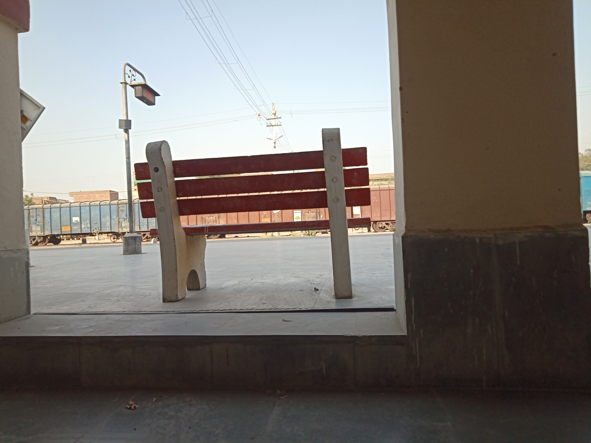
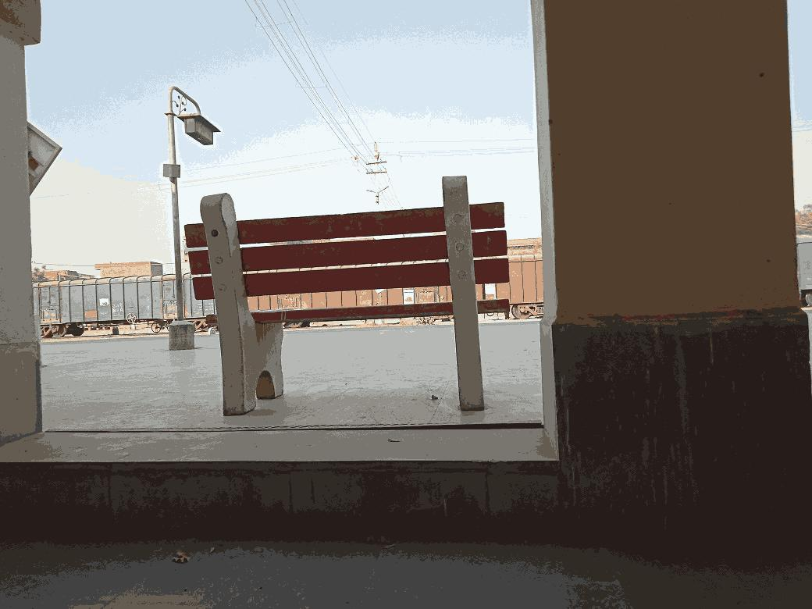
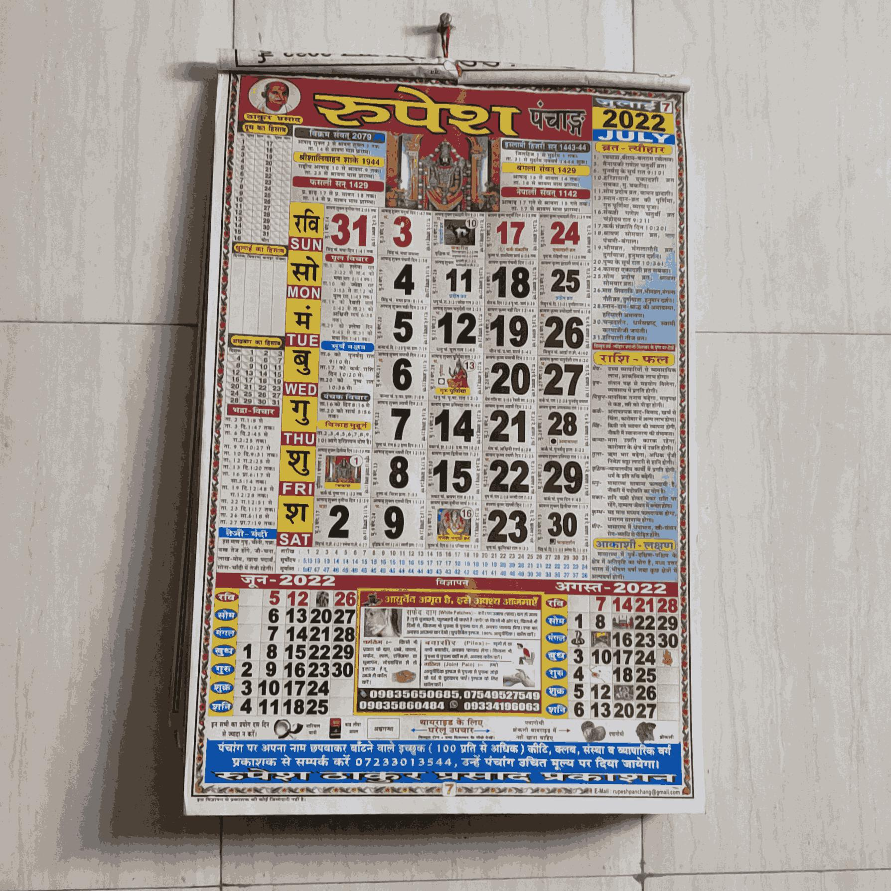

# Machine Learning Assignment 2 on Image quantization 


##### Submitted by Lalit (MCS - 22) and Vidhi Khare (MCS - 54)

##### Submitted To : Prof. Vasudha Bhatnagar


## Introduction

As per the given problem we have to take two picture one of outdoor location and second of an object on the wall of our home and create a codebook and quantize the image.


We have to create 4 bit, 8 bit and 12 bit codebooks.

Generally , in a colored image , each pixel is of size 3 bytes (RGB) where color can have intensity values from 0 to 255.
As we know that 4 bit has 2<sup>4</sup> = 16 colors and similarly for 8 bit and 12 which has 256 and 4096 colors.
	
Quantization is a lossy compression technique achieved by compressing a range of values to a single quantum value. When the number of discrete symbols in a given stream is reduced, the stream becomes more compressible. For example, reducing the number of colors required to represent a digital image makes it possible to reduce its file size.

## Approach

Color quantization can be done using clustering  where each of the color pixels will be grouped into clusters and each cluster will then be represented as a unique color in the new image. And here we are using __KMeans__.


## Tools and packages used

- python jupyter
- numpy
- KMeans , from sklearn
- matplotlib
- Pillow (for image loading saving etc.)

## Procedure

- Going to get the images and then load those in our project and then will convert them into an np array (in 8 bit color image)
- Get the original shape of the image ie width, height and depth
- Reshaping the image array
- Use KMeans forming clusters and no of clusters is no of colors 
- Recreating the image back and write the obervations.


## Code 

```python

#Defining the number of bits to be used and number of colors to be used
#n_bits = 4, 8, 12
n_bits = int(input("Enter the number of bits to be used (4, 8, 12): "))
n_colors = 2**n_bits

# Loading the image
image_name = input("Enter the name of the image to be Quantized: ")
image = Image.open(image_name)

# Convert to floats instead of the default 8 bits integer coding. 
# Dividing by 255 is important so that plt.imshow behaves works well on float data (need to be in the range [0-1])
image = np.array(image, dtype=np.float64)/255

# Load Image and transform to a 2D numpy array.
w, h, d = original_shape = tuple(image.shape)
image_array = np.reshape(image, (w * h, 3))

print("---------- Fitting model ----------")
kmeans = KMeans(n_clusters=n_colors, random_state=0).fit(image_array)

# Get labels for all points
print("Predicting color indices on the full image (k-means)")
labels = kmeans.predict(image_array)

# Recreate the (compressed) image from the code book & labels
def recreate_image(codebook, labels, w, h):
    return codebook[labels].reshape(w, h, -1)

# Displaying and Saving the Quantized image
plt.axis("off")
print(f"Quantized image ({n_colors} colors, K-Means)")
plt.imsave("qti.jpg", recreate_image(kmeans.cluster_centers_, labels, w, h))
plt.imshow(recreate_image(kmeans.cluster_centers_, labels, w, h))

```


__Running the above the code for both the images and for all three options__


### Image 1 (Outdoor image of a Railway Station)


#### Original Image




This is the original image and the details of elements are quite visible in this image.
Dimensions of the image is 1040 x 780 px taking size 2.50 MB


#### 4 Bits 


Now lets look 4 bit quantize image 




__Observations__ : The difference is clearly visible here, Look at the sky, there is a clear distinction between the different shades of the colors of the sky. And why so, the reason is simple in original image we had somewhat around 96,615 colors but here we have quantized the image into 4 bit, that is 16 colors.

The same difference can be seen on floor in the image. There are different shades of grey and black in the original picture and there the dust kind of particles can be seen but in quantized image these are not visible clearly and here only two shades of grey are visible.

__Codebook__ 

```python
array([[0.3223426 , 0.24592218, 0.17529732],
       [0.78712174, 0.85432532, 0.90667613],
       [0.47764182, 0.4596491 , 0.43585597],
       [0.15251028, 0.11741676, 0.10603203],
       [0.63644951, 0.64417844, 0.62927175],
       [0.94124689, 0.9739545 , 0.97822212],
       [0.39496972, 0.35731082, 0.32094564],
       [0.90907283, 0.81005503, 0.68769283],
       [0.26216115, 0.2610399 , 0.26019431],
       [0.85284311, 0.91276604, 0.95627993],
       [0.31143346, 0.14136356, 0.13131114],
       [0.71412018, 0.72267153, 0.71254054],
       [0.56905868, 0.55607564, 0.5326591 ],
       [0.91032138, 0.91559276, 0.88173225],
       [0.82479528, 0.64079125, 0.51565052],
       [0.19362266, 0.16895232, 0.15183069]])
```


#### 8 Bits


__Observation__ : The difference is almost unnoticable. Because now we have 256 colors. We can see some difference in sharpness but it is almost unnoticable but we can find difference when we zoom and analyse different area of the image. 

For example see the LED display on pole in the original it is more visible than that in the quantized image.


#### 12 Bits


__Observation__ : Again difference is almost unnoticable but if we would look in deep then we may find notice. Also to differentiate we can see the size of both the images which are almost equivalent but not equal, this is again due to compression that happened while quantizing the image using kMeans. (Quantized Image = 2.1 MB, Original Image = 2.50 MB)


### Image 2 (Indoor image of a Calendar on a wall)


#### Original Image


This is the original image and details related to numbers, diffrent characters and their respective colors along with different shades and patterns are quite visible in this image. 

Dimensions of the image is 1788 x 1788 px taking size 1.88 MB


#### 4 Bits 


Now lets look at 4 bit quantized image 




__Observations__ : The difference is clearly visible here, Look at the wall the different shade of color white are not clearly visble here and also the shadow of the calendar with black-grey color is now having different patches of color ditinctively visible.

In other parts of the calendar too the colors are now dull as compared to the original image and the shades of pink and light yellow are not visible at all. And why so, the reason is again the same as above, the original image that we had was composed of somewhat around 96,615 colors but here we have quantized the image into 4 bit, that is only 16 colors.

__Codebook__ 

```python
array([[0.58825941, 0.40552151, 0.27330148],
       [0.72082246, 0.69197447, 0.66012571],
       [0.30825965, 0.26950553, 0.22492618],
       [0.57226819, 0.53275326, 0.51013481],
       [0.75868721, 0.73798781, 0.71377821],
       [0.80268746, 0.69905632, 0.24119883],
       [0.05225487, 0.31411629, 0.65198797],
       [0.47412371, 0.44829162, 0.43741813],
       [0.6584676 , 0.62125185, 0.59165653],
       [0.81972774, 0.82136291, 0.83386841],
       [0.13707328, 0.11177452, 0.08695134],
       [0.22543229, 0.18313983, 0.15149711],
       [0.50700343, 0.1773512 , 0.19824294],
       [0.52268325, 0.62303913, 0.73819978],
       [0.39891186, 0.36038528, 0.33484941],
       [0.79234188, 0.77741057, 0.75764695]])
```


#### 8 Bits


__Observation__ : The difference here are also almost unnoticable as was the case with outdoor image quantized with 256 colors (8 bits). We can see some difference in areas that were exposed to more light as compared to there surrounding but it is almost unnoticable but we can find difference when we zoom and analyse different area of the image. 

For example see the area of the two red strips, there are few spots which are in dark red color as compared to the original. This change in color is only visible after very close oservation of both the images.


#### 12 Bits


__Observation__ : Difference in unnoticeable here even after very close observations. Also it could also be observed through the size of images which are almost equivalent (Quantized Image Size: 1.2 MB, Original Image Size: 1.88 MB). 
